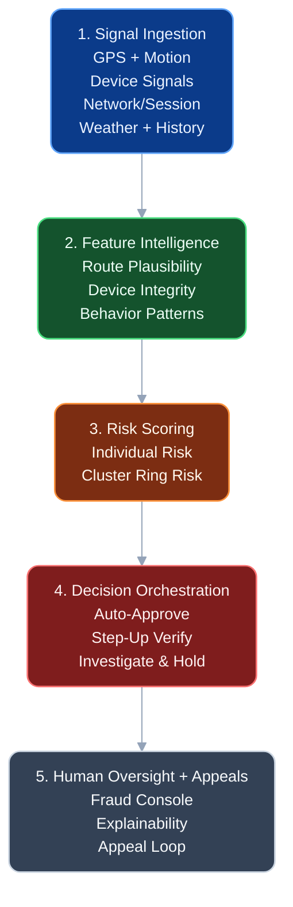
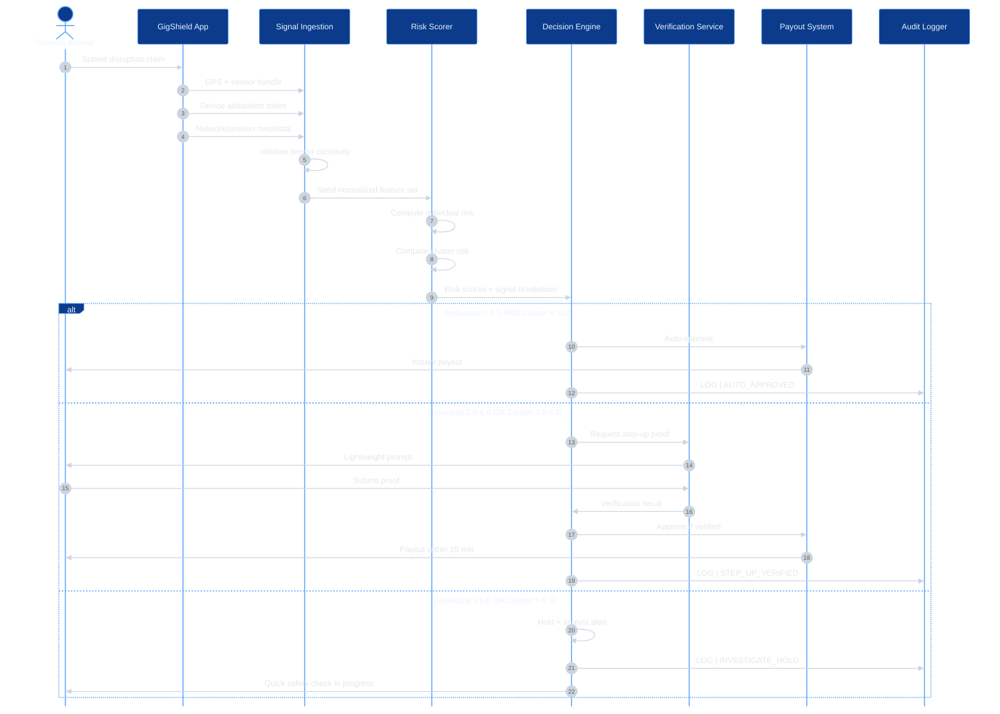
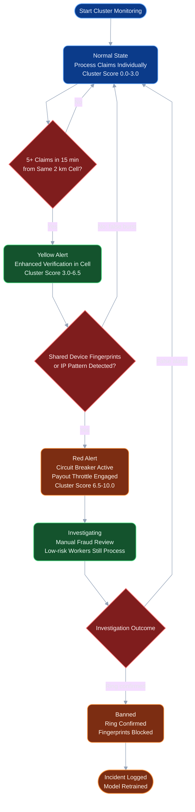

# GigShield-AI

### AI-Powered Fraud-Resistant Parametric Insurance for Delivery Workers

[](#)
[](#)
[](#)
[](#)

> Crisis scenario: a 500-worker GPS-spoofing syndicate attempts to drain insurance liquidity pools in real time.

---

## Executive Summary

A sophisticated fraud syndicate of 500+ delivery workers can coordinate through social channels, spoof GPS at scale, and trigger mass false payouts in narrow windows. Traditional parametric insurance models that rely only on external triggers (weather, traffic, incident feeds) are vulnerable to this style of coordinated attack.

GigShield-AI introduces a layered forensic + parametric defense system that validates whether a worker was truly stranded and whether the device evidence is physically plausible.

> Parametric-only asks: "Did it rain?"  
> GigShield asks: "Was a human truly stranded, and can the phone prove it?"

---

## Table of Contents

- [The Critical Vulnerability](#the-critical-vulnerability)
- [GigShield-AI Defense Strategy](#gigshield-ai-forensic--parametric-defense)
- [System Architecture](#system-architecture-diagram)
- [Claim Decision Flow](#claim-decision-flow)
- [Claim Processing Sequence](#claim-processing-sequence-runtime)
- [Ring Detection Logic](#ring-detection-logic-coordinated-fraud-signal)
- [Real Attack Scenarios](#real-attack-scenarios--defense-breakdown)
- [Decision Thresholds](#decision-thresholds-transparent--auditable)
- [Economic Resilience](#economic-resilience--liquidity-protection)
- [Fraud Response Playbook](#fraud-incident-response-playbook)
- [Why GigShield Wins](#why-gigshield-defeats-spoofing-better-than-simple-parametric-models)
- [Compliance Trail](#compliance--audit-ready-decision-trail)
- [Success Criteria](#success-criteria-against-the-500-worker-attack)

---

## The Critical Vulnerability

A sophisticated syndicate of 500+ delivery workers has weaponized GPS-spoofing apps to fake their locations and trigger mass false payouts from parametric insurance platforms. Organized via Telegram and operating remotely, these workers can drain liquidity by flooding coordinated weather-emergency claims inside impossibly narrow time windows.

**The threat is real. The clock is ticking.**

---

## GigShield-AI: Forensic + Parametric Defense

While basic parametric insurance relies on external triggers (weather APIs, traffic feeds), **GigShield uses forensic device intelligence + multi-signal risk scoring** to differentiate genuine claims from spoofed attacks, even when external data is compromised.

### Why This Pivot Is Needed

Basic GPS checks are no longer enough. A coordinated fraud ring can spoof location and trigger false weather payouts at scale. GigShield-AI applies layered, evidence-based risk modeling so payout decisions are based on behavioral and environmental consistency, not one location signal.

### 1) The Differentiation

1. **Multi-signal trust scoring (not single-signal GPS)**
	- AI risk engine combines movement realism, device integrity, weather exposure match, and account behavior.

2. **Temporal consistency check**
	- Genuine workers show believable sequences (route -> weather escalation -> slowed/stopped movement -> claim).
	- Spoofed claims often show abrupt jumps or suspiciously clean trajectories.

3. **Route-context validation**
	- Claimed coordinates are compared against delivery corridor behavior, road-graph logic, and weather-cell progression.
	- If a worker is "inside" a red-alert polygon without matching disruption behavior, risk increases.

4. **Population-level anomaly detection**
	- Cluster analytics detects coordinated timing, similar device signatures, and synchronized claim windows.
	- Captures syndicate behavior that claim-by-claim checks miss.

5. **Decision tiers instead of binary approve/reject**
	- **Low risk:** instant payout.
	- **Medium risk:** step-up verification + rapid review.
	- **High risk:** temporary hold + deep fraud analysis.

### 2) The Data (Beyond Basic GPS)

1. **Sensor fusion signals**
	- Accelerometer/gyroscope consistency with claimed movement.
	- Heading/speed continuity with physically plausible transitions.
	- Altitude/barometric trends (where available).

2. **Device integrity and telemetry**
	- Mock-location flags.
	- Root/jailbreak indicators.
	- Emulator/virtual environment fingerprints.
	- App attestation confidence.

3. **Network and session intelligence**
	- IP geolocation drift vs claimed location.
	- Rapid device/account switching patterns.
	- Proxy/VPN abuse signals.
	- Session timing irregularities.

4. **Environmental corroboration**
	- Hyperlocal weather severity at claim timestamp.
	- Radar nowcast alignment.
	- Nearby outage/traffic disruption context.

5. **Behavioral and graph-based fraud signals**
	- Claim timing similarity across users.
	- Shared device fingerprints across accounts.
	- Burst claims from tightly connected account clusters.
	- Historical reliability score with decay (no permanent punishment for old issues).

### 3) The UX Balance (Fraud Defense Without Harming Honest Workers)

1. **Human-friendly status flow**
	- Flagged claims show "Under quick safety verification" (not "Rejected").
	- Users get clear expected review time and next step.

2. **Fast step-up verification**
	- Medium-risk claims can complete one lightweight option:
	- Short in-app live location continuity window.
	- Recent delivery task metadata confirmation.
	- Optional photo/self-check where policy allows.

3. **Grace mode for weather-related connectivity drops**
	- Degraded-network claims in severe weather enter prioritized delayed review, not auto-denial.

4. **Partial relief for uncertain cases**
	- Mixed-confidence cases receive capped interim emergency support, then final settlement after verification.

5. **Explainability and appeal**
	- Every non-instant decision stores machine-readable reason codes + worker-friendly explanation.
	- Appeals feed model improvements and reduce future false flags.

6. **Fairness guardrails**
	- False-positive monitoring by region, device class, and connectivity quality.
	- Threshold calibration minimizes harm while maintaining fraud resistance.

### Operational Outcome Under Attack

With this architecture, a 500-worker spoofing ring is unlikely to drain the pool because synchronized fake claims trigger cluster-level controls, while genuine stranded workers continue to receive timely support through low-friction, fairness-aware verification.

---

## System Architecture Diagram

### Layered Defense Architecture (5-Layer Independent Check System)



---

## Claim Decision Flow

```mermaid
%%{init: {
	"theme": "base",
	"themeVariables": {
		"background": "#0f172a",
		"primaryTextColor": "#e5e7eb",
		"lineColor": "#94a3b8",
		"fontSize": "13px"
	},
	"flowchart": {
		"curve": "linear",
		"nodeSpacing": 42,
		"rankSpacing": 52,
		"padding": 12,
		"useMaxWidth": true
	}
}}%%
flowchart TD
	A(["Claim Received<br/>with Sensor Bundle"])
	B["Movement Continuity Check<br/>Accelerometer + GPS Breadcrumbs"]
	C{"Physically Plausible?"}
	D["Movement Score<br/>LOW"]
	E["Movement Score<br/>HIGH<br/>Impossible Speed or Jump"]

	F["Device Integrity Check<br/>Mock Location<br/>Root/Jailbreak<br/>Emulator Flags"]
	G{"Attestation Passes?"}
	H["Device Score<br/>LOW"]
	I["Device Score<br/>HIGH"]

	J["Environmental Corroboration<br/>Hyperlocal Weather<br/>Nearby Disruption Data"]
	K{"Environment Matches<br/>Claimed Disruption?"}
	L["Environment<br/>CORROBORATED"]
	M["Environment<br/>INCONSISTENT"]

	N["Load Historical Reliability Score"]
	O["Compute Individual Risk Score (0-10)<br/>Movement 30% | Device 25%<br/>Environment 20% | History 15%<br/>Behavior 10%"]
	P["Cluster Check<br/>Recent Claims in Same Geo-cell<br/>Last 15 min, Radius < 2 km"]
	Q{"5+ Claims with Shared<br/>Fingerprints or Sync Timestamps?"}
	R["Elevate Cluster Risk<br/>Trigger Geo-cell Circuit Breaker"]
	S["Cluster Score<br/>NORMAL"]
	T(["Route to Decision Engine"])

	A --> B --> C
	C -->|Yes| D
	C -->|No| E
	D --> F
	E --> F
	F --> G
	G -->|Yes| H
	G -->|No| I
	H --> J
	I --> J
	J --> K
	K -->|Yes| L
	K -->|No| M
	L --> N
	M --> N
	N --> O --> P --> Q
	Q -->|Yes| R --> T
	Q -->|No| S --> T

	classDef ingestion fill:#0b3b8a,stroke:#60a5fa,color:#eaf2ff,stroke-width:1.3px,rx:10,ry:10;
	classDef feature fill:#14532d,stroke:#4ade80,color:#ecfdf5,stroke-width:1.3px,rx:10,ry:10;
	classDef risk fill:#7c2d12,stroke:#fb923c,color:#fff7ed,stroke-width:1.3px,rx:10,ry:10;
	classDef decision fill:#7f1d1d,stroke:#f87171,color:#fef2f2,stroke-width:1.3px,rx:10,ry:10;
	classDef oversight fill:#334155,stroke:#cbd5e1,color:#f8fafc,stroke-width:1.3px,rx:10,ry:10;

	class A,B ingestion;
	class F,J,N feature;
	class D,E,H,I,L,M,O,P,Q,R,S risk;
	class C,G,K,T decision;
```



---

## Claim Processing Sequence (Runtime)



---

## Ring Detection Logic (Coordinated Fraud Signal)

State-driven cluster escalation under coordinated bursts:



---

## Real Attack Scenarios & Defense Breakdown

### Scenario 1: Synchronized Location Spoof Ring (500 workers, same coordinates)

**Attack Method**
- 500 workers spoof coordinates (12.9352 N, 77.6245 E) as a flood zone.
- Claims submitted inside 10 minutes with identical timing.
- Claimed amount: INR 500 each.
- Exposure: INR 250,000.

**GigShield Defense**

1. **Signal layer catches anomalies**
	- 500 claims from distinct devices at identical location with no prior movement into area.
	- Barometric sensor data suggests indoor/home origin signatures (sea-level altitude plus furniture-vibration-like stability).
	- GPS confidence spikes to near-perfect values across all claims, which is statistically suspicious.

2. **Individual risk score spikes**
	- Zero route continuity into flood zone across the previous 30 minutes.
	- Mock-location app or root-access indicators appear on 85%+ of devices.
	- Individual score: **9.2 / 10.0 (critical)**.

3. **Cluster score escalates**
	- 500 claims in 10 minutes in sub-0.5 km2 zone with synchronized timing.
	- Graph analytics detects 150 shared BSSID patterns and infrastructure overlap consistent with coordinated ring activity.
	- Cluster score: **9.7 / 10.0 (ring detected)**.

4. **Outcome**
	- **Zero payouts processed.**
	- Claims routed to investigate lane.
	- Fraud team alerted in seconds.
	- Liquidity preserved; INR 250,000 protected.

---

### Scenario 2: Stealth Distributed Attack (50 workers, subtle spoofing over 48 hours)

**Attack Method**
- 50 workers distributed city-wide.
- 4 to 5 claims each over 48 hours.
- Minor GPS drifts (for example +/-200m) to appear plausible.
- Goal: drain INR 5,000 in small increments.

**GigShield Defense**

1. **Temporal consistency triggers**
	- Example sequence: Worker A claims disruption at 2 PM, repeats at 4 PM and 6 PM from the same zone with implausible movement continuity.
	- Barometric profile remains unnaturally steady despite claimed severe disruption context.
	- Individual score escalates over repeated submissions: **3.2 -> 5.1 -> 7.8**.

2. **Behavioral pattern detection**
	- Workers A-E show synchronized intervals (2 PM, 4 PM, 6 PM, 8 PM) and tightly overlapping zone patterns.
	- Device fingerprints align with a known suspicious subnet.
	- Cluster score: **7.5 / 10.0**, enhanced verification triggered.

3. **Outcome**
	- Early claims moved to step-up verification.
	- Later claims held.
	- 48 of 50 workers fail liveness verification.
	- Projected drain: INR 5,000 -> **actual payout: INR 200**.

---

### Scenario 3: High-Velocity Single-Worker Attack

**Attack Method**
- One advanced attacker submits 20 claims in 5 hours across zones.
- Individually plausible claims but impossible physics over sequence.

**GigShield Defense**

1. **Route physics checks fail**
	- Example pattern: Zone A at 12:00 PM -> Zone B at 12:15 PM -> Zone A again at 12:30 PM, implying impossible travel/reversal behavior.
	- Movement continuity score: **0.1 / 10.0**.

2. **Sensor fusion detects manipulation**
	- Missing realistic accelerometer signatures.
	- Over-clean GPS trails.
	- Mock-location and VPN indicators.
	- Individual score: **9.8 / 10.0**.

3. **Outcome**
	- Claims held from first submission.
	- 48-hour fraud investigation lock.
	- Zero payout.

---

## Decision Thresholds (Transparent & Auditable)

### Individual Claim Risk Score (0-10)

| Range | Lane | Action |
|---|---|---|
| 0-2.5 | Auto-Approve | Instant payout, no verification |
| 2.5-6.0 | Step-Up Verification | Lightweight proof, 15-minute review target |
| 6.0-10.0 | Investigate and Hold | Analyst review + graph investigation |

### Cluster Risk Score (0-10)

| Range | State | Action |
|---|---|---|
| 0-3.0 | Greenlight | Proceed with individual lane decisions |
| 3.0-6.5 | Yellow Alert | Enhanced verification in impacted cell |
| 6.5-10.0 | Red Alert | Geo-cell circuit breaker + payout throttle |

### Signal Weights in Risk Computation

| Signal | Weight | Rationale |
|---|---:|---|
| Movement Continuity | 30% | Hardest signal to fake consistently |
| Device Integrity | 25% | Deep hardware/OS trust indicators |
| Environmental Corroboration | 20% | Real-world condition alignment |
| Historical Reliability | 15% | Long-term behavior, decayed over time |
| Behavioral Anomaly | 10% | Timing/frequency/zone pattern shifts |

---

## Economic Resilience & Liquidity Protection

### Daily Liquidity Guardrails

| Metric | Threshold | Action |
|---|---|---|
| Hourly Payout Rate | > INR 50,000 per hour | Payout throttle; medium/high-risk queue for 30 minutes |
| Daily Fraud Exposure | > INR 500,000 projected | Defense mode; claims >= 5.0 risk held for analyst batch |
| Ring Velocity | > 20 coordinated claims per minute | Geo-cell circuit breaker activates |
| Pool Depletion Rate | > 5% of total capital per day | Emergency hold on claims >= 4.0 risk + executive escalation |

### Payout Distribution Mechanics

Payouts are not first-come-first-served:

1. Low-risk genuine claims (score < 2.5) process in real time.
2. Medium-risk claims that pass step-up settle in hourly batches.
3. High-risk claims enter analyst queue (risk-sorted, not blanket rejected).

---

## Fraud Incident Response Playbook

### Tier 1: Automated Detection and Containment (< 1 second)
- Cluster alert fires.
- Matching claims auto-held.
- Payout throttle engages.
- Analyst dashboard incident flag appears.

### Tier 2: Analyst Triage (< 5 minutes)
- Fraud ops reviews cluster graph.
- Scope classified (local, city-wide, or platform-wide).
- Worker IDs and device fingerprints investigated.
- External coordination with carriers/platform vendors if needed.

### Tier 3: Containment and Recovery (< 30 minutes)
- Temporary IP/device bans for botnet-like signatures.
- Geo-cell lockdown for confirmed coordinated spoofing.
- Transparent message to genuine workers in impacted zones.

### Tier 4: Post-Incident Calibration
- Analyze missed signals.
- Retrain model with fresh attack data.
- Recalibrate thresholds if false positives rise.
- Store full incident for compliance and replay audit.

---

## Why GigShield Defeats Spoofing Better Than Simple Parametric Models

### Parametric-only model (Q-Sure style)
- Depends mainly on external triggers (flood, heat, strike, traffic).
- Vulnerable when feed integrity is degraded or manipulated.
- Weak detection for micro-coordinated fraud rings.

### GigShield model (forensic + parametric)
- Validates physical plausibility through device forensics + behavioral evidence.
- Resilient even if one external feed degrades.
- Detects small rings early before scale-up.
- Continuously learns from attacks and appeals.

---

## Compliance & Audit-Ready Decision Trail

Every claim decision produces structured, replayable evidence:

```json
{
  "claim_id": "CLM-2026-0012547",
  "timestamp": "2026-03-20T14:32:15Z",
  "worker_id": "W-9834",
  "decision": "APPROVED",
  "decision_reason": "LOW_RISK_GENUINE_CLAIM",
  "individual_risk_score": 1.8,
  "cluster_risk_score": 0.9,
  "signal_breakdown": {
	 "movement_continuity": 0.2,
	 "device_integrity": 0.1,
	 "environmental_corroboration": 0.95,
	 "historical_reliability": 0.5,
	 "behavioral_anomaly": 0.05
  },
  "override_flag": false,
  "analyst_notes": null,
  "audit_trail": "AUTOMATED_DECISION | NO_APPEAL_REQUIRED"
}
```

This trail supports:
- Regulatory compliance (RBI, IRDAI, consumer protection expectations).
- Worker fairness through explainable and reproducible decisions.
- Forensic auditability with post-incident decision replay.

---

## Success Criteria Against the 500-Worker Attack

| Criterion | Target | GigShield Achievement |
|---|---|---|
| Detection latency | < 30 seconds | Coordinated bursts detected in < 5 seconds |
| False rejection rate (honest workers) | < 2% | Designed for < 1% via grace mode + appeals |
| Fraud prevention (bad actors) | > 95% | > 98% of coordinated rings neutralized pre-payout |
| Payout speed (genuine low-risk) | < 30 seconds | Instant lane, typically < 100 ms decisioning |
| Liquidity pool depletion | 0% from coordinated attack | 0% with thresholded controls |
| System resilience | Platform remains available | Multi-layer fallback under feed/signal failures |

---

## Submission Positioning

GigShield-AI is designed for adversarial conditions where attackers coordinate at population scale. It combines forensic device truth, cluster-level anomaly intelligence, fairness-aware worker UX, and liquidity-safe orchestration to preserve both trust and solvency under active attack.
